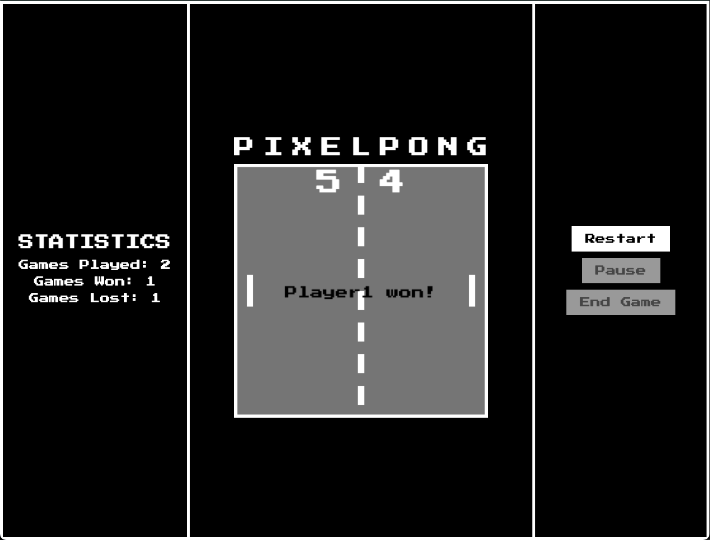

# PixelPong

**PixelPong** is a minimalist Pong game built using HTML5 Canvas and JavaScript. The game features two players who compete to score points by hitting a ball back and forth across the screen. The first player to reach 5 points wins the game.

## How to Play

- **Player 1 (Left Side):**
  - Move Up: `W`
  - Move Down: `S`

- **Player 2 (Right Side):**
  - Move Up: `Arrow Up`
  - Move Down: `Arrow Down`

### Game Controls
- **Start Game:** Click the "Start Game" button to begin the game.
- **Pause Game:** Click the "Pause" button (or the space key) to pause and resume the game.
- **End Game:** Click the "End Game" button to stop the game entirely.

### Objective
- The goal of the game is to score by making the ball pass the opposing player's side of the screen.
- When a player scores, the ball resets to the center, and the players return to their starting positions.
- The first player to reach **5 points** wins.

## Features
- **Responsive Game Layout:** The game automatically adjusts to different screen sizes, ensuring consistent gameplay.
- **Smooth Ball Movement:** The ball's speed increases gradually as the game progresses, adding challenge.
- **Score Display:** The current score is displayed on the canvas, with a winning message when a player reaches 5 points.
- **Reset Mechanism:** After each point, the ball and players reset for the next round.
- **Pause Functionality:** The game can be paused and resumed at any time.

## Where to play?
Here you can find the link to the deployment of the game. Enjoy playing 😎   
⭐ <a href="https://breffjaun.github.io/PixelPong/" target="_blank">Link to play the Game</a> ⭐

